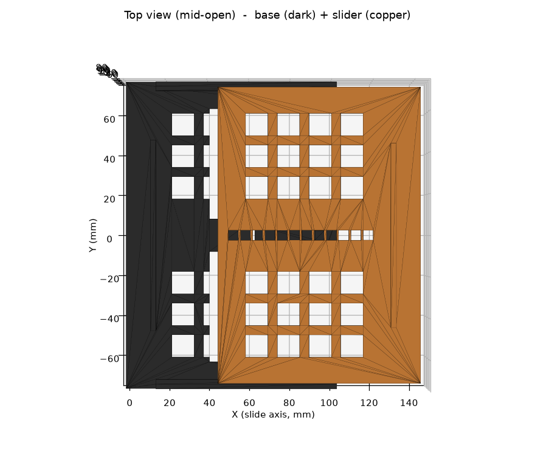
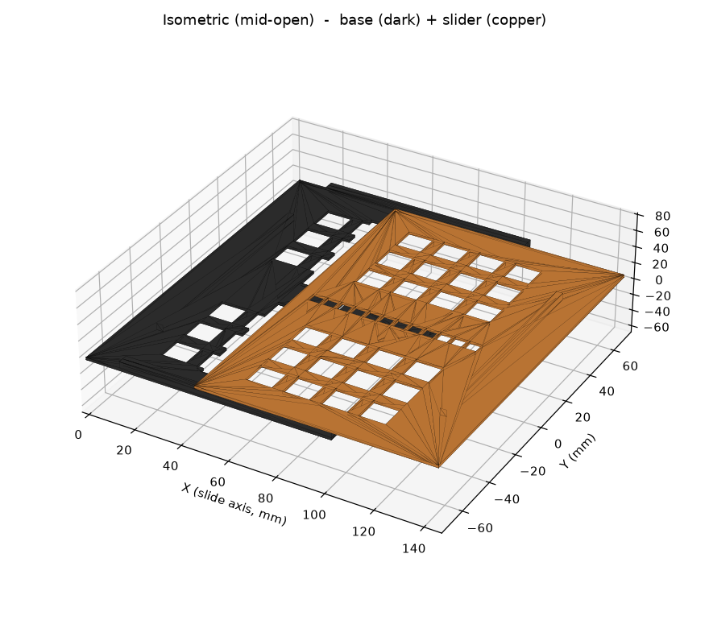

# Adjustable Vase Lid — "Stem Organizer"

A 3D-printable lid for a flower vase that lets a bouquet's stems come through in
an organized way. Inspired by the *StemSlider*, but reworked to be fully
3D-printable with no foam or velcro.

It is **adjustable**: a two-piece drawer-slide telescopes open/closed to fit a
range of vase mouths and **ratchets/locks** at the chosen size.



*Base (dark) + slider (copper), shown mid-open. Renders are generated by
`render_preview.py`.*

---

## What it does

- Fits vase mouths roughly **90–150 mm** across (configurable).
- Slide the **slider** out to enlarge the lid; a sprung **lock finger** clicks
  into the next lock hole and holds the size. Push the finger to resize.
- A **grid of square holes** organizes individual stems; the open centre
  accommodates the thick main bundle and widens as you expand.
- **Locating lips** on the two sliding ends drop just inside the mouth to centre
  the lid, while the outer shoulders rest on the rim so it can't fall in.

### Design trade-off (please read)
The lid adjusts along **one axis** (a simple, robust slide), so its footprint
goes from roughly square when closed (≈114 mm) toward oblong when fully open
(≈174 × 150 mm). It always rests on the rim and the inner lips keep it centred,
but on a large *round* vase the front/back edges will overhang more than the
sliding ends. This is the inherent cost of a telescoping slide vs. a radial
(iris) mechanism.

---

## The two parts

| File | Print | Notes |
|---|---|---|
| `stl/vase_lid_base.stl`   | ×1 | plate + C-channel edge rails + sprung lock finger |
| `stl/vase_lid_slider.stl` | ×1 | plate whose edges ride in the base rails; row of lock holes |

Both print **flat on the bed, features pointing up, no supports**.
Footprints: base ≈ 103 × 150 mm, slider ≈ 99 × 145 mm — both fit a 256 × 256 mm
plate (A1 / P1 / X1) with room to spare. (For an A1 mini, 180 mm, they still
fit individually.)

The slider sits on top of the base (a ~3 mm step) and is captured by the rail
lips. In use you flip the assembled lid over so the lips point down into the vase.

---

## How to print (Bambu)

1. **Slicer:** open `vase_lid_plate.3mf` in **Bambu Studio** (desktop). It
   contains both parts laid out flat. Alternatively import the two STLs.
2. **Orientation:** leave as-is (flat, features up). **No supports needed.**
3. **Suggested settings:**
   - Material: **PETG** if it may contact water/humidity; **PLA** is fine if it
     stays dry. Geometry is identical either way.
   - Layer height **0.2 mm**, **3 wall loops**, **15–20 % infill**, no brim.
4. **Slice → Send to printer.** The job then appears in the **Bambu Handy** app
   to start and monitor.

> **About Bambu Handy:** the Handy app does not slice raw STL/3MF itself — it
> starts and monitors jobs that were sliced in Bambu Studio (or published to
> MakerWorld) and synced to your printer. So the workflow is always
> *model → Bambu Studio/MakerWorld → slice → Handy*. The files here are the
> model; a pre-sliced job depends on your specific filament/printer profile and
> is best produced in Bambu Studio.

---

## Assembly & use

1. Slide the **slider** into the **base**: feed its two long edges into the
   base's rail channels from the open (inner) end and push until the lock finger
   clicks. It only goes in one way.
2. Set the size: pull the slider out until the lid's two lips span your vase
   mouth; let the finger click into the nearest lock hole.
3. Flip the assembled lid so the lips/rails point **down**, drop it onto the
   vase (lips inside the mouth, shoulders on the rim), and feed stems through
   the square holes.
4. To resize: push the lock finger (from the underside) to release, slide, and
   re-lock.

Tip: a strip of soft foam tape on the locating lips (like the original
StemSlider) improves grip on smooth/odd rims.

---

## Regenerating / customizing

Everything is parametric. Edit the variables at the top of `vase_lid.py` and
rebuild:

```bash
pip install -r requirements.txt
./build.sh           # or: python3 vase_lid.py && python3 render_preview.py
```

Key parameters (`vase_lid.py`):

| Parameter | Default | Meaning |
|---|---|---|
| `FIT_MIN` / `FIT_MAX` | 90 / 150 | smallest / largest vase-mouth span (mm) |
| `SHOULDER` | 12 | rest overhang outside each locating lip |
| `Y_OUTER` | 150 | fixed depth of the lid (front-to-back) |
| `T` | 3 | plate thickness |
| `LIP_H` / `LIP_W` | 8 / 2.6 | locating-lip height / wall thickness |
| `SQUARE` / `HOLE_GAP` | 11 / 4.5 | square stem-hole side / wall between holes |
| `LOCK_PITCH` | 6 | size step between lock detents |
| `CLR` | 0.30 | sliding / capture clearance (tune to your printer) |
| `NUB_H` / `FINGER_SLOT` | 2.2 / 1.4 | lock-nub height / finger flex slot |
| `MIN_ENGAGE` | 28 | rail overlap retained when fully open |

Common tweaks after a test print:
- **Slides too tight / too loose:** adjust `CLR` (±0.05 mm).
- **Lock too stiff / won't hold:** lower/raise `NUB_H`, or widen `FINGER_SLOT`.
- **Different vase range:** change `FIT_MIN` / `FIT_MAX`. If `FIT_MAX` makes a
  part exceed your bed, reduce the range or split is needed.
- **Hole size/spacing:** `SQUARE` / `HOLE_GAP`.

---

## Files

```
vase-lid/
  vase_lid.py            parametric model (edit + run this)
  render_preview.py      makes preview_top.png / preview_iso.png
  build.sh               runs both
  requirements.txt       python deps
  stl/
    vase_lid_base.stl    print x1
    vase_lid_slider.stl  print x1
  vase_lid_plate.3mf     both parts flat -> open in Bambu Studio
  vase_lid_assembled.3mf preview of the mated assembly (mid-open)
  preview_top.png, preview_iso.png
```

> Note: this folder is self-contained and unrelated to the rest of the
> repository (a golf-analytics project); it just lives here on this branch.
